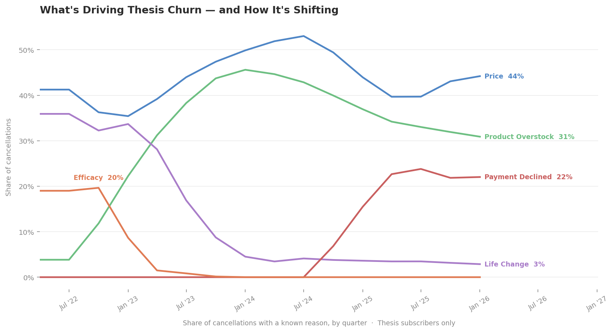

# Bellwether

Subscription churn prediction & autonomous intervention for a DTC supplements
partner running two product lines on a subscription model.

A *bellwether* is the lead whose movement foretells the flock. Just like them, our system's job is to act **before** a subscriber cancels, rather than trying to win them back after.

Bellwether shifts TakeThesis from reactive saves to proactive prediction and autonomous intervention. It reads leading indicators to identify which subscribers are likely to cancel in the next 30–60 days, routes each one to the most relevant intervention archetype, and drafts a personalized outreach — without requiring a human in the loop for every decision.

The design philosophy is simple: machine learning handles the prediction, deterministic code handles the routing and guardrails, and the language model handles only the judgment calls it's genuinely suited for — which intervention fits this subscriber, and what to say.

## What it does

An end-to-end pipeline, not a dashboard:

1. **Score** — point-in-time features over the subscriber base feed a calibrated
   churn-risk model with explainable per-subscriber risk factors.
2. **Classify** — each at-risk subscriber is routed to a churn *archetype*
   (price, efficacy, fatigue/overstock, life change, stimulant change, involuntary).
3. **Intervene** — an agent selects an archetype-appropriate action from several
   paths and drafts it; deterministic guardrails and a configurable human-in-the-loop
   threshold gate execution.
4. **Dispatch** — actions go through an adapter seam (simulated in the sandbox; a
   real Klaviyo/Zendesk adapter is the single production swap-point).
5. **Learn** — every action and outcome is logged back to the warehouse and feeds a
   feedback loop that tunes future scoring and intervention selection.

## Scope — one clean slice, by design

**The business problem.** TakeThesis runs its revenue on subscriptions, and the default retention motion is reactive: win a subscriber back *after* they cancel, once intent has hardened and the offer has to be expensive. The leverage is upstream — read the leading indicators and act while the subscriber is still active. Bellwether is a working slice of that motion, taken end to end: score → classify → intervene → dispatch → learn.

**The scope decision.** With the time available, the goal was one population carried cleanly through every stage on real data, rather than a shallow pass over the entire base. So the question wasn't "how do we cover everyone" — it was "which population can we build a complete, honest slice for first." That population is **active Thesis subscribers**.

**Why Thesis, not the whole base.** The partner sells on subscription across two lines: **Thesis**, its adult cognitive-performance supplements, and **Stasis**, which includes a children's line (Stasis Kids). We built on Thesis. It carries the richest structured signal — THESIS_FORMULAS coverage gives a formula-based feature set Stasis doesn't have — and it's the larger line (79% of the base). Stasis is a genuinely different problem, not a missing slice of the same one: parent-driven purchases, a distinct stimulant-sensitivity profile, and different household economics all change what churn even *means*. Pooling the two would suppress signal in both. Stasis earns its own model on this architecture, not a `BRAND` flag bolted onto this one.

### Population funnel

| Stage | Count | What it is |
| --- | --- | --- |
| All subscriptions | 566,743 | Both product lines, full history |
| Thesis subscriptions | 449,902 | In-scope line, full history |
| **Active Thesis, scored** | **26,584** | `STATUS = 'active'` at the 2026-04-21 snapshot |

The active book is what the slice acts on, because it's what you can still act on. The ~423K inactive Thesis subscriptions are where the model *learns*: the label builder walks back to historical observation points (365 / 270 / 180 / 90 days before the snapshot) and, at each, marks who was active then and who cancelled within the horizon. Past leavers are the labels; the live book is scored.

Of the 26,584 scored, **2,247 (8.5%)** clear the P ≥ 0.10 intervention threshold and **94 (0.35%)** clear P ≥ 0.50 — calibrated probabilities, not rank cutoffs (see *Risk thresholds*).

### How it expands

The slice is built to widen without a rewrite. Stasis is the next population: same pipeline, a brand-specific archetype taxonomy, its own golden set — a sibling model, not a fork. Brand voice, risk thresholds, the human-in-the-loop gate, and the dispatch target are all externalized config (see *Configuration surface*), so a pivot in tone, caution, or destination is a settings change rather than an engineering project.

## Design stance

- Deterministic code owns scoring, routing, eligibility, guardrails, and dispatch.
- The model is used only for the judgment call: which intervention fits, and what to
  say. That is what makes this an agent rather than a rules engine.
- Gradient-boosted trees + SHAP for risk (explainable, full-scale), not a fine-tuned
  model where a simpler one suffices.

## Why archetypes, and why they adapt



This chart is the empirical backbone of the whole system, which is why it leads the README rather than sitting in an appendix. Three things it earns its place by showing:

1. **The archetypes are measured, not invented.** The six routing buckets aren't a designer's intuition about why people leave — they're the actual decomposition of cancellations with a stated reason. The classifier routes on a taxonomy the data already validates.
2. **Churn drivers are non-stationary.** Efficacy churn ran near 20% in 2022 and is now effectively 0%. Payment-declined churn went the other way — from near zero to 22%. Life Change collapsed from 36% to 3%. The *mix moves*. A static "send a 20%-off win-back coupon" playbook is optimized for last year's reason for leaving. This is the data argument for an archetype-routed system that re-scores every cycle instead of a fixed retention offer.
3. **It says where to aim today.** Price (44%) and Product Overstock (31%) are three-quarters of current churn — and neither is a discount problem. Price needs value reframing; overstock needs cadence adjustment. That is the case for intervention *diversity* over a single save offer, made in one picture.

Honest caveat (fail loud): this is the share *among cancellations with a known reason*. If reason-capture coverage itself shifts over time, the mix can move for collection reasons as well as behavioral ones. We read the chart as direction-of-travel evidence, not as precise quarter-over-quarter magnitudes.

## Risk thresholds

Risk is a calibrated probability, not a percentile rank. The model is gradient-boosted trees with an isotonic calibration layer, so a score of 0.10 means roughly a 10% chance of cancelling within the 30-day horizon — and the count of high-risk subscribers is whatever genuinely clears the bar, not a fixed top-N.

- **P ≥ 0.50 — high.** More likely than not to cancel; 94 subscribers at the snapshot.
- **P ≥ 0.10 — medium.** Worth an intervention; 2,247 subscribers.

Because the bands are probability cutoffs, they are tunable without retraining: raising the floor narrows outreach to the most certain cases, lowering it widens the net.

## Brand voice — chosen by A/B test

The agent's tone wasn't picked by taste. We ran two voice configurations through the LLM-as-judge harness against held-out subscriber contexts:

- **Warm** — "warm, specific, non-desperate."
- **Brand** — "confident, precise, performance-oriented."

The judge was first calibrated against human ratings, then used to score both voices. **Warm won at r = 0.779 vs 0.725** and is the shipped default. The full configuration lives in `configs/thesis.yaml` and can be swapped without retraining the risk model — voice is a presentation-layer choice, deliberately decoupled from scoring.

## Configuration surface

What a partner can change without touching the pipeline code:

| Knob | Where | Effect |
| --- | --- | --- |
| Brand voice | `configs/thesis.yaml` | Tone of every drafted message; A/B-selectable |
| Risk thresholds | scoring config | Width of the intervention net (no retrain) |
| Human-in-the-loop gate | intervention config | Which actions auto-send vs await approval |
| Archetype taxonomy | `configs/thesis.yaml` | Routing buckets and their labels |
| Dispatch target | adapter seam | Simulated → Klaviyo/Zendesk, one class swap |

A second line (Stasis) is a new config + golden set against the same architecture, not a code fork.

## Data boundary

- Reads only from the read-only `SOURCE` schema.
- Writes only to namespaced (`BELLWETHER_`) tables in the `OUTPUTS` schema.
- Credentials come from the environment, never argv or disk.

## Setup

```bash
python -m venv .venv && source .venv/bin/activate
pip install -r requirements.txt
cp .env.example .env   # then fill in SNOWFLAKE_PASSWORD and ANTHROPIC_API_KEY
```

`connect.sh` is a read-only Snowflake query helper for ad-hoc exploration.
